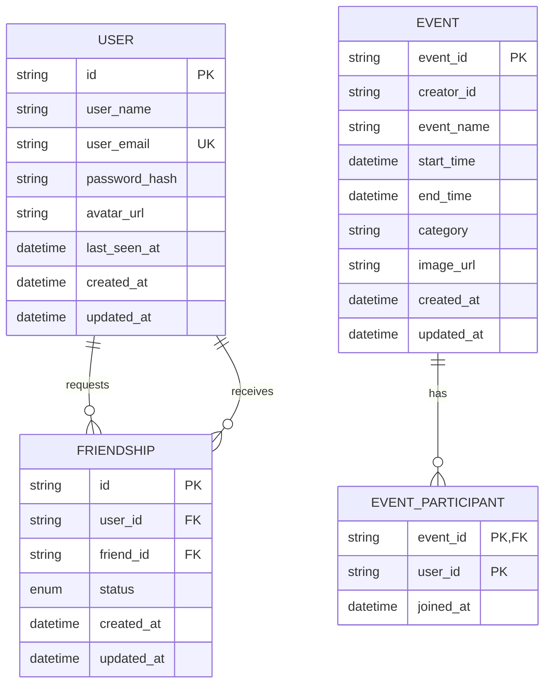

*This project has been created as part of the 42 curriculum by pdrettas, ewu, hpehliva, and dpaluszk.*

# Transcendence

A containerized community-event platform where users can discover, create, manage, and join events while connecting with other users.

## Contents

- [Overview](#overview)
- [Team and Project Management](#team-and-project-management)
- [Architecture](#architecture)
- [Features](#features)
- [Technical Stack](#technical-stack)
- [Prerequisites](#prerequisites)
- [Installation and Setup](#installation-and-setup)
- [Configuration](#configuration)
- [Usage](#usage)
- [API Documentation](#api-documentation)
- [User Permissions](#user-permissions)
- [Database Schema](#database-schema)
- [Modules](#modules)
- [Testing and Verification](#testing-and-verification)
- [Operations](#operations)
- [Project Status and Limitations](#project-status-and-limitations)
- [Bonus](#bonus)
- [Resources and AI Use](#resources-and-ai-use)


## Overview

Transcendence is a multi-user web application for community events. Visitors can browse public events and public profiles. Registered users can maintain a profile, manage friendships and online presence, create events, upload event images, and join or leave events.

The application is composed of a React frontend, a Fastify API gateway, separate user and event services, and MySQL. Docker Compose starts the full application stack, including TLS-enabled backend servicesi, observability tooling, and scheduled backups.

## Team and Project Management


### Team members


| Member                             | Documented implementation areas | Formal role                     |
| ---------------------------------- | ------------------------------- | ------------------------------- |
| Erya Wuu (`ewu`)                   | Backend, Frontend, Design       | Technical Lead, Developer       |
| Paula Drettas (`pdrettas`)         | Frontend, Design                | Product Owner, Developer        |
| Halime Pehlivan (`hpehliva`)       | Backend, Database               | Architect, Developer            |
| Dariusz Paluszkiewicz (`dpaluszk`) | Cybersecurity, Monitoring       | Project Manager (PM), Developer |


### Working practices

The Git history shows 33 focused feature branches, including a main and dev branch. 
Docker Compose and the project `Makefile` provide a repeatable shared development environment.

The following project-management practices were executed:

- **Planning:** The team met weekly to review progress, plan upcoming work, and address blockers.
- **Task tracking:** Tasks and project planning were managed with Atlassian tools.
- **Communication:** Slack and a WhatsApp group were used for day-to-day coordination.
- **Code review:** Contributors submitted pull requests and selected the reviewer best suited to review the relevant change before it was merged to the main branch.


## Architecture

```text
Browser
  │
  ├── HTTP ──> React + Vite frontend :8080
  │                 │
  │                 │ /api and /uploads proxy
  │                 ▼
  └── HTTPS ─> Fastify API gateway :3000
                      │
          ┌───────────┴───────────┐
          ▼                       ▼
  User service :3001       Event service :3002
          │                       │
          └────────── TLS ────────┘
                      │
                 MySQL :3306

Prometheus ──> Grafana dashboards / Alertmanager
     │
MySQL exporter

db-backup ──> encrypted MySQL dumps and upload archives
```


| Component      | Responsibility                                                                                                                                                                              |
| -------------- | ------------------------------------------------------------------------------------------------------------------------------------------------------------------------------------------- |
| Frontend       | React single-page application for authentication, event browsing and management, user profiles, friendships, legal pages, and language selection.                                           |
| API gateway    | The only browser-facing backend entry point. It terminates HTTPS, verifies JWTs, validates gateway requests, serves uploads, exposes Swagger UI, and proxies requests to internal services. |
| User service   | Owns users, authentication data, profiles, friendships, and online-presence heartbeats.                                                                                                     |
| Event service  | Owns events, event participation, event ownership checks, and event data.                                                                                                                   |
| MySQL          | Stores service-owned application data. User and event services use separate Prisma schemas and communicate across the service boundary through HTTPS.                                       |
| Monitoring     | Prometheus collects metrics from the gateway, services, and MySQL exporter. Grafana provides dashboards, while Alertmanager delivers configured alerts.                                     |
| Backup service | Creates scheduled TLS MySQL dumps and archives uploaded media when present.                                                                                                                 |


### Repository structure

```text
ft_transcendence/
├── apps/api-gateway/        # HTTPS gateway, Swagger, public API, uploads
├── services/
│   ├── user-service/        # Users, authentication, friendships, presence
│   └── event-service/       # Events and event participation
├── frontend/                # React + Vite client and design system
├── database/                # MySQL image and initialization scripts
├── monitoring/              # Prometheus, Grafana, Alertmanager, exporter config
├── scripts/                 # Certificates, HTTPS checks, backup and restore scripts
├── backups/                 # Generated backup destination; archives are ignored by Git
├── docker-compose.yml
├── Makefile
└── .env.example
```


## Features


| Area                               | Available functionality                                                                                                                                                                                                                                                                                                                                | Primary contributors          |
| ---------------------------------- | ------------------------------------------------------------------------------------------------------------------------------------------------------------------------------------------------------------------------------------------------------------------------------------------------------------------------------------------------------ | ----------------------------- |
| Authentication                     | Email-and-password registration and login. Passwords are hashed with `bcryptjs`; the gateway issues JWT access tokens.                                                                                                                                                                                                                                 | `ewu`, `hpehliva`             |
| Decoupled Services                 | User service and event service are decoupled and communicate through HTTPS.                                                                                                                                                                                                                                                                            | `ewu`, `hpehliva`             |
| Events management                  | Browse event cards and details; authenticated users can create, edit, delete, join, and leave events. Event owners can retrieve the number of joined users.                                                                                                                                                                                            | `ewu`, `pdrettas`, `hpehliva` |
| Users management                   | Users have different roles, each role has different permissions and views, users can send, accept and decline friend requests. Role based account management system.                                                                                                                                                                                   | `ewu`, `hpehliva`, `pdrettas` |
| Public endpoints                   | CRUD public endpoints for profile and event management with OpenAPI 3.0.0 specification.                                                                                                                                                                                                                                                               | `ewu`                         |
| Endpoints protection               | Endpoints are protected with API keys and rate limiting.                                                                                                                                                                                                                                                                                               | `hpehliva`                    |
| Health check and Disaster recovery | Health and status endpoints for every services, database backup and restore.                                                                                                                                                                                                                                                                           | `ewu`, `dpaluszk`, `hpehliva` |
| Monitoring                         | Health and metrics endpoints, Prometheus, Grafana, Alertmanager, MySQL metrics.                                                                                                                                                                                                                                                                        | `dpaluszk`                    |
| Advanced search                    | Server-side text search, category filtering, sorting and pagination.                                                                                                                                                                                                                                                                                   | `pdrettas`                    |
| UI system                          | Custom design system with centralized CSS tokens in `index.css`, an SVG icon set (26 named icons in `Icon.tsx`), and ten reusable components: `Button`, `Input`, `Select`, `Avatar`, `Badge`, `Card`, `Modal`, `EmptyState`, `Alert`, and `Icon`. See `[frontend/src/design-system/README.md](ft_transcendence/frontend/src/design-system/README.md)`. | `ewu`                         |
| Media                              | Avatar and event-image uploads through the gateway. Uploads are stored and served from the gateway's `/uploads/` path.                                                                                                                                                                                                                                 | `ewu`, `pdrettas`, `hpehliva` |
| Browser compatibility              | Full compatibility with Chrome, Firefox, Edge, 90% compatibility with Safari. 404 and 500 page design is not yet implemented.                                                                                                                                                                                                                          | `ewu`, `pdrettas`             |
| Internationalization               | English, French, Arabic, and Chinese locale files, a language switcher, and document-direction handling for right-to-left Arabic.                                                                                                                                                                                                                      | `ewu`, `hpehliva`             |
| Legal pages                        | Privacy Policy and Terms of Service routes linked from authentication and application layouts.                                                                                                                                                                                                                                                         | `hpehliva`                    |


## Technical Stack


| Area              | Technology                                                                 | Role in this project                                                     |
| ----------------- | -------------------------------------------------------------------------- | ------------------------------------------------------------------------ |
| Frontend          | React 19, TypeScript, Vite 8, React Router                                 | Builds and routes the browser application.                               |
| Localization      | i18next and react-i18next                                                  | Supplies the language switcher and locale resources.                     |
| Backend           | Fastify 5 and TypeScript                                                   | Powers the API gateway and both internal services.                       |
| Authentication    | `@fastify/jwt`, `bcryptjs`                                                 | Issues and verifies JWTs; hashes and compares passwords.                 |
| API documentation | `@fastify/swagger`, `@fastify/swagger-ui`                                  | Exposes interactive API documentation at `/docs`.                        |
| Persistence       | MySQL 8.4 and Prisma 6                                                     | Stores data and manages service-specific schemas and migrations.         |
| Containerization  | Docker Compose, Node 20 Alpine images                                      | Runs the complete development stack with one command.                    |
| Security          | TLS certificates, internal service token, API key, multipart upload limits | Secures backend traffic, internal calls, public API access, and uploads. |
| Monitoring        | Prometheus, Grafana, Alertmanager, `prom-client`, MySQL exporter           | Collects metrics, provisions dashboards, and sends configured alerts.    |
| Backups           | MySQL client tools and shell scripts                                       | Produces compressed full-database dumps and optional upload archives.    |


## Prerequisites

- Docker Engine with Docker Compose v2.
- GNU Make.
- OpenSSL, used by `make up` to generate local development certificates when absent.
- FeatuA modern browser; the project requirement targets the latest stable Google Chrome.

Node.js is supplied by the project containers, so a host Node.js installation is not required for the standard Docker workflow.

## Installation and Setup

Run the following commands from the repository root:

```bash
cd ft_transcendence
cp .env.example .env
cp .secrets/gmail_app_password_example .secrets/gmail_app_password
```

Edit `.env` and replace every placeholder secret with a secure local value. Then replace the placeholder in `.secrets/gmail_app_password` with the Gmail App Password used by Alertmanager. That secret file is ignored by Git and must never be committed.

Start the full stack:

```bash
make up
make ps
```

`make up` generates a local certificate authority and service certificates when required, then starts Docker Compose in detached mode. On first startup, the user and event services install dependencies, apply Prisma migrations, and run their seed commands.

Once the services are running:


| Service      | Default address               |
| ------------ | ----------------------------- |
| Frontend     | `http://localhost:8080`       |
| API gateway  | `https://localhost:3000`      |
| Swagger UI   | `https://localhost:3000/docs` |
| Prometheus   | `https://localhost:9090`      |
| Grafana      | `https://localhost:3003`      |
| Alertmanager | `https://localhost:9093`      |


Useful lifecycle commands:

```bash
make logs       # Stream Docker Compose logs
make down       # Stop the stack
make rebuild    # Rebuild images without cache and recreate services
make restart    # Restart services
make backup     # Create a one-shot backup
```

> `make reset`, `make clean`, and `make fclean` remove Docker volumes and can delete local database data. Use them only when that loss is intended.


## Configuration

The project loads configuration from `ft_transcendence/.env`. Keep `.env` local; it is ignored by Git. `.env.example` is the tracked template.


| Variable group                  | Variables                                                                             | Purpose                                                                     |
| ------------------------------- | ------------------------------------------------------------------------------------- | --------------------------------------------------------------------------- |
| Application ports               | `API_GATEWAY_PORT`, `USER_SERVICE_PORT`, `EVENT_SERVICE_PORT`, `FRONTEND_PORT`        | Publishes application services to the host.                                 |
| Service URLs                    | `USER_SERVICE_URL`, `EVENT_SERVICE_URL`                                               | Provides internal HTTPS service locations to the gateway and event service. |
| MySQL                           | `MYSQL_PORT`, `MYSQL_ROOT_PASSWORD`, `MYSQL_DATABASE`, `MYSQL_USER`, `MYSQL_PASSWORD` | Configures MySQL and application database credentials.                      |
| JWT                             | `JWT_SECRET`, `JWT_ISSUER`, `JWT_AUDIENCE`, `JWT_EXPIRES_IN`                          | Configures gateway-issued access tokens.                                    |
| Internal service authentication | `INTERNAL_SERVICE_TOKEN`                                                              | Shared token required for gateway-to-service and service-to-service calls.  |
| Public API                      | `PUBLIC_API_KEY`                                                                      | Required in the `X-API-Key` header for `/api/v1/public/*`.                  |
| Uploads                         | `UPLOAD_DIR`                                                                          | Storage location for gateway-managed media.                                 |
| Grafana                         | `GF_ADMIN`, `GF_PASSWORD`, `GRAFANA_PORT`                                             | Configures Grafana credentials and host port.                               |
| Prometheus and Alertmanager     | `PROMETHEUS_PORT`, `ALERTMANAGER_PORT`                                                | Publishes monitoring services.                                              |
| MySQL exporter                  | `MYSQL_EXPORTER_USER`, `MYSQL_EXPORTER_PASSWORD`, `MYSQL_EXPORTER_PORT`               | Configures MySQL metric collection.                                         |
| Backups                         | `BACKUP_INTERVAL_SECONDS`, `BACKUP_RETENTION_DAYS`                                    | Controls scheduled backup frequency and retention.                          |


The separate `.secrets/gmail_app_password` file is mounted into Alertmanager. It is required for the repository's email-alert configuration.

## Usage

The React frontend is available at `http://localhost:8080`. It proxies `/api` and `/uploads` to the API gateway at `https://localhost:3000`. The browser-facing frontend is intentionally HTTP in local development; the gateway, user service, event service, and database connections use TLS. When running Vite outside Docker, trust the local CA or set `NODE_EXTRA_CA_CERTS=.certificates/ca/ca.crt`.

1. Open `http://localhost:8080`.
2. Register an account or log in with an existing account.
3. Browse the event dashboard, open event details, and view public user profiles.
4. Use the protected interface to edit the current profile, upload an avatar, manage friends, and select a language.
5. Create an event with a name, start time, end time, and category. Optionally add a description, location, minimum participant count, and image.
6. Join or leave an event. Event owners can edit or delete their events and view their joined-user count.


## API Documentation

The API gateway is available at `https://localhost:3000`. Interactive OpenAPI documentation is available at:

```text
https://localhost:3000/docs
```


### Authentication

Application routes use `Authorization: Bearer <access-token>` after login. Registration and login are public.


| Method | Route                   | Authentication | Purpose                                                  |
| ------ | ----------------------- | -------------- | -------------------------------------------------------- |
| `POST` | `/api/v1/auth/register` | None           | Create an account.                                       |
| `POST` | `/api/v1/auth/login`    | None           | Authenticate and receive an access token plus user data. |


Registration requires `userName`, `email`, and `password`. The gateway validates a user name of 2–100 characters, an email address, and a password of 8–72 characters.

```json
{
  "userName": "Ada Lovelace",
  "email": "ada@example.com",
  "password": "a-secure-password"
}
```


### Application routes


| Method   | Route                                                  | Authentication      | Purpose                                                                            |
| -------- | ------------------------------------------------------ | ------------------- | ---------------------------------------------------------------------------------- |
| `GET`    | `/api/v1/events`                                       | None                | List public events.                                                                |
| `GET`    | `/api/v1/events/:eventId`                              | None                | Retrieve one event.                                                                |
| `POST`   | `/api/v1/events`                                       | Bearer JWT          | Create an event.                                                                   |
| `PUT`    | `/api/v1/events/:eventId`                              | Bearer JWT; owner   | Update an event.                                                                   |
| `DELETE` | `/api/v1/events/:eventId`                              | Bearer JWT; owner   | Delete an event.                                                                   |
| `POST`   | `/api/v1/events/:eventId/join`                         | Bearer JWT          | Join an event.                                                                     |
| `DELETE` | `/api/v1/events/:eventId/join`                         | Bearer JWT          | Cancel participation.                                                              |
| `GET`    | `/api/v1/events/:eventId/joined-count`                 | Bearer JWT; owner   | Retrieve participation count.                                                      |
| `POST`   | `/api/v1/events/:eventId/image`                        | Bearer JWT; owner   | Upload or replace an event image; multipart field: `file`.                         |
| `GET`    | `/api/v1/users/me/events`                              | Bearer JWT          | List events joined by the current user.                                            |
| `GET`    | `/api/v1/users`                                        | Bearer JWT          | List community users.                                                              |
| `GET`    | `/api/v1/users/:userId`                                | Optional Bearer JWT | Retrieve a public profile; an authenticated owner receives their own profile data. |
| `PUT`    | `/api/v1/users/:userId`                                | Bearer JWT; self    | Update the current user's profile.                                                 |
| `DELETE` | `/api/v1/users/:userId`                                | Bearer JWT; self    | Delete the current user's account.                                                 |
| `POST`   | `/api/v1/users/me/avatar`                              | Bearer JWT          | Upload or replace the current user's avatar; multipart field: `file`.              |
| `POST`   | `/api/v1/users/me/heartbeat`                           | Bearer JWT          | Update current-user presence.                                                      |
| `GET`    | `/api/v1/users/me/friends`                             | Bearer JWT          | List accepted friends and their presence.                                          |
| `GET`    | `/api/v1/users/me/friend-requests`                     | Bearer JWT          | List incoming friend requests.                                                     |
| `POST`   | `/api/v1/users/:userId/friends`                        | Bearer JWT          | Send a friend request.                                                             |
| `POST`   | `/api/v1/users/me/friend-requests/:requesterId/accept` | Bearer JWT          | Accept a friend request.                                                           |
| `POST`   | `/api/v1/users/me/friend-requests/:requesterId/reject` | Bearer JWT          | Reject a friend request.                                                           |
| `DELETE` | `/api/v1/users/me/friends/:friendId`                   | Bearer JWT          | Remove a friendship.                                                               |


Event creation requires `eventName`, `startTime`, `endTime`, and `category`. Supported categories are `Social`, `Sports`, `Games`, `Food`, `Learning`, `Outdoors`, and `Arts & Culture`. `description`, `location`, and `minParticipant` are optional. The gateway accepts one uploaded image with a maximum size of 5 MiB.

### Advanced search

It extends `GET /api/v1/events` with the following optional query parameters.


| Parameter  | Accepted values                          | Purpose                                         |
| ---------- | ---------------------------------------- | ----------------------------------------------- |
| `q`        | Text, maximum 255 characters             | Searches event name, description, and location. |
| `category` | A supported event category               | Filters events by category.                     |
| `sort`     | `startTime`, `eventName`, or `createdAt` | Selects the sort field.                         |
| `order`    | `asc` or `desc`                          | Selects the sort direction.                     |
| `page`     | Positive integer                         | Selects a result page.                          |
| `pageSize` | Integer from 1 to 100                    | Selects the number of events per page.          |


It returns a paginated response containing `items`, `page`, `pageSize`, `total`, and `totalPages`, and its dashboard provides search, filter, sort, and Previous/Next pagination controls.

### Public API

The public surface is separate from the browser application API:

```text
https://localhost:3000/api/v1/public
```

Every public request requires `X-API-Key: <PUBLIC_API_KEY>`. The gateway limits requests to 100 per minute per client and returns HTTP `429` when the limit is exceeded. Event mutations also require `X-User-Id: <acting-user-uuid>`; updates and deletes require that user to own the event.


| Method   | Route                            | Purpose                         |
| -------- | -------------------------------- | ------------------------------- |
| `GET`    | `/api/v1/public/events`          | List events.                    |
| `GET`    | `/api/v1/public/events/:eventId` | Retrieve an event.              |
| `POST`   | `/api/v1/public/events`          | Create an event.                |
| `PUT`    | `/api/v1/public/events/:eventId` | Update an event.                |
| `DELETE` | `/api/v1/public/events/:eventId` | Delete an event.                |
| `GET`    | `/api/v1/public/users/:userId`   | Retrieve a public user profile. |


Example public request:

```bash
curl --cacert .certificates/ca/ca.crt \
  -H "X-API-Key: $PUBLIC_API_KEY" \
  https://localhost:3000/api/v1/public/events
```


### Operational endpoints


| Route                              | Purpose                                                                    |
| ---------------------------------- | -------------------------------------------------------------------------- |
| `GET /health`                      | API gateway health response.                                               |
| `GET /metrics`                     | Prometheus metrics from the API gateway.                                   |
| `GET /api/v1/status`               | Gateway response containing user-service and event-service health results. |
| `GET /uploads/:category/:filename` | Serves stored avatar and event images.                                     |
| `GET /docs`                        | Swagger UI (includes the **public** API tag).                              |


Common API errors are `400` for invalid input or missing required headers, `401` for invalid authentication, `403` for unauthorized ownership operations, `404` for missing resources, `409` for duplicate accounts or invalid friendship state, and `429` for public API rate-limit violations.

## User Permissions


| User type          | Allowed actions                                                                                                                |
| ------------------ | ------------------------------------------------------------------------------------------------------------------------------ |
| Visitor            | Register, log in, list public events, view event details, and view public profiles.                                            |
| Authenticated user | Manage their own profile and avatar, maintain friendships, update presence, create events, and join or leave events.           |
| Event owner        | Update, delete, and change the image of their own event; retrieve the event's joined-user count.                               |
| Public API client  | Read public events and profiles with an API key; create, update, or delete events only with an API key and acting-user header. |


The repository does not implement a separate administrator role or role-management system.

## Database Schema

The user service and event service own separate Prisma schemas. Cross-service user/event information is retrieved through HTTPS instead of a Prisma relation spanning services.




| Entity             | Important fields                                                                                                                 | Relationships                                                                                                |
| ------------------ | -------------------------------------------------------------------------------------------------------------------------------- | ------------------------------------------------------------------------------------------------------------ |
| `User`             | UUID `id`; unique `userEmail`; `passwordHash`; profile fields; `avatarUrl`; `lastSeenAt`; timestamps.                            | Has outgoing and incoming friendship records.                                                                |
| `Friendship`       | UUID `id`; `userId`; `friendId`; `pending` or `accepted` status; timestamps.                                                     | References the requesting and receiving users; unique per directed pair.                                     |
| `Event`            | UUID `eventId`; `creatorId`; name; start/end times; category; description; location; participant minimum; image URL; timestamps. | Has event-participant records. `creatorId` is a service-boundary reference, not a Prisma relation to `User`. |
| `EventParticipant` | Composite key of `eventId` and `userId`; `joinedAt`.                                                                             | References the event. `userId` remains an event-service-boundary reference.                                  |


## Modules


| Module                                      | Size  | Points | Implementation evidence                                                                                        |
| ------------------------------------------- | ----- | ------ | -------------------------------------------------------------------------------------------------------------- |
| Frontend and backend frameworks             | Major | 2      | React frontend and Fastify gateway/services.                                                                   |
| Standard user management and authentication | Major | 2      | Registration, login, JWT, own-profile updates, avatar handling, friendships, and presence.                     |
| Public API                                  | Major | 2      | API key, 100 request/minute limit, Swagger documentation, and six public endpoints.                            |
| ORM                                         | Minor | 1      | Prisma schemas, migrations, and generated client in user and event services.                                   |
| Custom design system                        | Minor | 1      | CSS tokens, icon set, and ten reusable React components.                                                       |
| Multiple languages                          | Minor | 1      | English, French, Arabic, and Chinese resources with a language switcher.                                       |
| Microservices backend                       | Major | 2      | API gateway, user service, and event service with HTTPS internal communication and clear service ownership.    |
| Monitoring system                           | Major | 2      | Prometheus, Grafana dashboards, Alertmanager, service metrics, and MySQL exporter.                             |
| Health checks, backups, and recovery        | Minor | 1      | Health/status endpoints, scheduled backup service, `make backup`, restore script, and recovery notes.          |
| Advanced search                             | Minor | 1      | Prisma text search, category filtering, sorting, pagination, gateway query forwarding, and dashboard controls. |
| Right-to-left (RTL) support                 | Minor | 1      | Arabic sets `document.dir` to `rtl`, updates `lang`, and adjusts UI direction (for example back-navigation).   |
| Support of 3 browsers                       | Minor | 1      | Verified compatibility with Google Chrome, Mozilla Firefox, and Microsoft Edge.                                |


**Total: 17 / 14 required points** (14 required + 4 extra)

## Testing and Verification

Start the stack before running the available HTTPS verification script:

```bash
cd ft_transcendence
make up
./scripts/test-https.sh
```

The script verifies the local certificate authority and HTTPS health endpoints for the API gateway, user service, event service, Prometheus, and Grafana.

The frontend also exposes build and lint scripts:

```bash
docker compose exec frontend npm run build
docker compose exec frontend npm run lint
```

The API gateway, user service, and event service define `test` scripts that currently exit with “no test specified”; there is no automated unit or end-to-end test suite configured in this branch. Before evaluation, manually verify registration, login, profile changes, account deletion, friendships, event lifecycle and participation, legal pages, language switching, browser-console output, public API access, health checks, metrics, backups, and every claimed module.

## Operations


### Health and monitoring

- Gateway health: `https://localhost:3000/health`
- Aggregated service status: `https://localhost:3000/api/v1/status`
- Gateway metrics: `https://localhost:3000/metrics`
- Swagger UI: `https://localhost:3000/docs`

Prometheus scrapes the gateway, both internal services, and MySQL exporter over HTTPS. Grafana provisioning includes backend and database dashboards. Alert rules cover service availability, HTTP error rate and latency, request volume, Node.js resource usage, and MySQL availability, connections, slow queries, and running threads.

### Backups and recovery

Health checks live on the gateway and services (`GET /health`, `GET /health/db`, `GET /api/v1/status`). Automated backups are handled by the `db-backup` Compose service.

**What is backed up**

- **MySQL** — full logical dump over TLS (`mysqldump --ssl-mode=REQUIRED`) → `backups/mysql-full-<timestamp>.sql.gz`
- **Uploads** (avatars / event images) — if present under `apps/api-gateway/uploads` → `backups/uploads-<timestamp>.tar.gz`
- Old files older than `BACKUP_RETENTION_DAYS` (default **7**) are deleted automatically

**Schedule**

On start, `db-backup` runs one backup immediately, then every `BACKUP_INTERVAL_SECONDS` (default **86400** = 24h). Configure both variables in `.env`.

Create a manual backup:

```bash
cd ft_transcendence
make backup
ls -lah backups/
```

Restore a dump created by the project:

```bash
make restore FILE=backups/mysql-full-YYYYMMDDTHHMMSSZ.sql.gz
docker compose restart user-service event-service api-gateway
```

> Restoring overwrites MySQL databases. Confirm the selected file before running this command, then restart the application services.

**If the database dies (runbook)**

1. Confirm health: `curl -k https://localhost:3000/api/v1/status` and/or `docker compose ps`
2. Pick the newest good dump in `./backups/`
3. Bring MySQL back if needed: `docker compose up -d database` (wait until healthy)
4. Restore: `make restore FILE=backups/mysql-full-....sql.gz`
5. Restart services: `docker compose restart user-service event-service api-gateway`
6. Optional uploads: `tar -xzf backups/uploads-....tar.gz -C apps/api-gateway`
7. Re-check `/health` and log in to verify data

Dump files under `backups/` are gitignored — keep copies off-machine for real disasters.

## Bonus

The subject requires a minimum of **14 module points**. This project implements **18 points** in total, so **4 bonus points** are claimed beyond the required set (the Modules table lists achieved modules including **Support of 3 browsers**; **Support on all devices** is listed only in this Bonus section).

### 1. Support on all devices (Minor — 1 point)

The frontend is built to work on desktop, tablet, and mobile viewports—not only on a wide screen.

What we did:

- **Responsive CSS:** Breakpoints at `1024px` and `720px` in `App.css` adapt the shell, grids, and page width.
- **Mobile layout:** On small screens the sidebar becomes a horizontal scrollable nav, the main app shell switches from a two-column grid to a stacked layout, and event/people grids collapse to fewer columns so the UI remains usable on phones.

| Module | Size | Points | Where it lives |
| Support on all devices | Minor | 1 | Responsive breakpoints and mobile shell/nav/grid layouts in `frontend/src/App.css` |

## Resources and AI Use


### Resources

- [User journey (Miro)](https://miro.com/welcomeonboard/REhQTURqVEI0Tm1oQ2lNTzNOeTNlOHI0czkvVTFFZ3luc2dqNXUrcURWdGFITHcrSE1RR2creHNLd2lDaHRwS1IwMUtSandUSXRYbU5jakRZbUl4TFhPWHRyWXlMcWZYMlZ1djl1S2VGVEtjc2E2bC9pZlRvaytnUWRPWjVZWndhWWluRVAxeXRuUUgwWDl3Mk1qRGVRPT0hdjE=?share_link_id=955325343219)
- [Design system documentation](ft_transcendence/frontend/src/design-system/README.md)
- [React documentation](https://react.dev/learn)
- [Fastify documentation](https://fastify.dev/docs/latest/)
- [Prisma ORM documentation](https://www.prisma.io/docs/orm/v6)
- [Docker Compose documentation](https://docs.docker.com/compose/)
- [Prometheus documentation](https://prometheus.io/docs/)
- [Grafana documentation](https://grafana.com/docs/)


### AI use

AI was used to structure this README and as a learning aid for technical explanations during development.